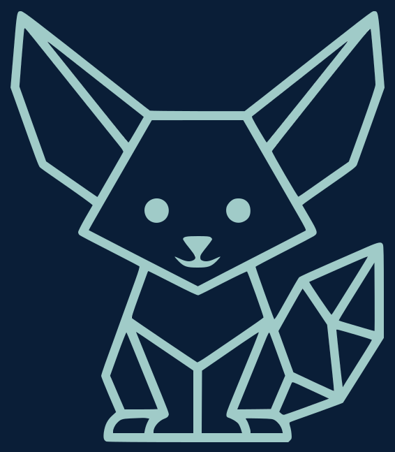

<p align="center">
  
</p>

<h1 align="center">Kelvra</h1>

<p align="center">
  <strong>Declare what an AI agent may know. Prove what it did.</strong>
</p>

<p align="center">
  A policy language and audit format for information flow in LLM agent pipelines.
</p>

<p align="center">
  <a href="#status">Status</a> ·
  <a href="#the-problem">Problem</a> ·
  <a href="#what-kelvra-is">What it is</a> ·
  <a href="#a-first-look">A first look</a> ·
  <a href="#prior-art">Prior art</a> ·
  <a href="#what-kelvra-does-not-guarantee">Limits</a> ·
  <a href="#roadmap">Roadmap</a> ·
  <a href="#license">License</a>
</p>

<p align="center">
  <a href="https://github.com/NICE-DEV226/kelvra/actions/workflows/ci.yml"></a>
  
  
  
</p>

---

## Status

**Early. Policies parse and enforce, and produce an audit record. Nothing is deployable.**

What exists:

- the [label model](spec/labels.md) — the algebra and the flow rule, written to be implemented without reading the code,
- the [`.klv` language](spec/policy-language.md) — grammar, semantics, and the diagnostic each malformed case must produce,
- the [provenance record](spec/provenance.md) and its [JSON schema](spec/provenance.schema.json) — the audit artifact, including its mapping onto OpenTelemetry GenAI spans,
- the [threat model](spec/threat-model.md) — who this defends against, and explicitly who it does not,
- the [known limitations](LIMITATIONS.md) — what is unbuilt, unverified, or unresolved,
- a reference implementation with no third-party dependencies, whose test suite executes every worked example in the specifications.

What does not exist: the MCP adapter, OpenTelemetry emission, a language server, imports in `.klv`, and any deployment anyone should rely on.

There is nothing to `pip install` from an index. If you want to argue with the design before it hardens, now is when that is worth most.

## The problem

An LLM agent reads data, calls tools, and writes to systems. In current frameworks there is no structural answer to a simple question:

> **Was this specific piece of data allowed to end up here?**

Indirect prompt injection — an attacker placing instructions inside an email, a web page, or a document the agent will read — is ranked LLM01 in the OWASP Top 10 for LLM Applications and is widely described as an unresolved architectural problem: a language model processes everything as one token sequence, with no reliable privilege boundary between the system prompt, the user's request, and retrieved content.

Commercial tooling answers with heuristics: injection classifiers, pattern-based PII redaction, runtime guardrails. These help, and they fail by construction on the cases they were not trained on.

The structural answer is **information flow control** (IFC), a field with roughly fifty years of results behind it. Kelvra does not try to reinvent it.

## What Kelvra is

Kelvra is **not another IFC engine**, and deliberately so — see [prior art](#prior-art). It is the layer above them:

| Artifact | Role |
|---|---|
| **Label vocabulary** | A portable way to express confidentiality, integrity, and purpose. Engine-independent. |
| **Policy language (`.klv`)** | The readable surface. Written by a developer, **reviewable by a compliance officer or an auditor.** |
| **Provenance record** | A signed, machine-readable record of every flow an agent run actually took. |
| **Reference implementation** | One implementation among others. Intentionally not the only one. |

**Your code does not move.** Kelvra attaches to an existing Python / LangChain / MCP agent and describes what it is allowed to do. There is nothing to rewrite and no framework to adopt.

### Why a specification language, not a programming language

Kelvra is still a language. It is not a language that executes.

- **What we want to constrain isn't ours.** The computation happens inside a model we don't control, in frameworks we didn't write, calling tools we didn't build. A language that executes must own the whole stack. A constraint layer attaches to what already exists.
- **The value is in being read, not run.** Execution is now a commodity. A file a non-programmer can open and validate as their organization's actual policy is not.
- **Adoption economics.** A programming language demands a rewrite. A policy file sits next to your code.
- **A spec outlives an implementation.** SQL outlived System R. A compiler maintained by one person dies with that person.

The precedent is TypeScript, which never executes anything — `tsc` erases every annotation and emits JavaScript. Its entire value is being read, then vanishing. It won *because* it never asked anyone to rewrite their JavaScript.

## A first look

This parses and runs. It is [the actual policy](examples/support_agent/policy.klv) the demo enforces — not an illustration kept in step by hand. The syntax is **not final**.

```kelvra
policy SupportAgent
version 1

principal customer, support_team, billing
purpose    support, billing_ops

# ---- Sources: what enters, and with which labels ----

source inbox.imap
    confidential(customer) for support
    integrity untrusted              # arrives from outside

source crm.customer_record
    confidential(customer, support_team) for support
    integrity trusted

# ---- Sinks: what each exit accepts ----

sink llm.openai
    accepts public                   # nothing confidential leaves for the model

sink slack.support_channel
    accepts confidential(support_team)

sink crm.write
    accepts confidential(customer, support_team)
    requires endorsed(reviewer)
    requires consent(customer)

# ---- Declassification: the only permitted crossings ----

declassify pii_redaction
    from confidential(customer)
    to   confidential(customer, support_team)   # widens the reader set
    audit always

endorse human_review
    from untrusted
    to   trusted
    requires consent(support_team)
```

Thirty lines. An auditor can read them and establish: three constrained exits, **exactly one** declassification, one integrity upgrade, two required consents. The agent's Python is untouched.

Two axes matter here, not one:

- **Confidentiality** — a set of principals allowed to read, plus a purpose. A lattice, not a `low/medium/high` scale, because "readable by the care team, for treatment purposes" does not project onto a linear axis.
- **Integrity** — who vouches for the data. This is the axis that describes prompt injection: untrusted content reaching a control decision is an *integrity* violation. A confidentiality-only model cannot express the attack that matters most.

`declassify` and `endorse` are the two places where something can go wrong, so they are the two places that get dedicated syntax and a mandatory audit entry. These are the standard terms from the IFC literature, used deliberately.

### The output that matters

Each run emits a signed provenance record — flows taken, declassifications used, consents granted, and **flows denied**. Machine-readable for tooling, summarizable to one page for an auditor. For a compliance team facing a traceability obligation, this record is the product; the policy file is how you configure it.

Two rules from [its specification](spec/provenance.md) are worth stating here, because both are easy to get wrong in a way nobody notices:

- **The record never contains the data it describes.** No message bodies, no tool arguments, no model output. A log of who touched confidential data, which itself contains that data, is a second copy of the problem — one shipped to auditors and retained for years.
- **The policy cannot change during a run.** Otherwise a record attests to policy *A* while some flows were checked against *B*, under a signature. A misleading record that looks authoritative is worse than no record.

For live telemetry, the record maps onto [OpenTelemetry GenAI](https://opentelemetry.io/docs/specs/semconv/registry/attributes/gen-ai/) spans rather than inventing a transport. Those conventions are still pre-stable, which is also the opening: a label extension has a real chance upstream while they are in development.

## Prior art

Kelvra exists downstream of real work. Anyone evaluating this project should read these first:

- **[CaMeL](https://arxiv.org/abs/2503.18813)** — *Defeating Prompt Injections by Design* (Google DeepMind, 2025). Attaches capabilities to every value, separates control flow from data flow inside a restricted interpreter.
- **[FIDES](https://arxiv.org/abs/2505.23643)** — *Securing AI Agents with Information-Flow Control* (Microsoft Research, 2025). Confidentiality **and** integrity labels, deterministic policy enforcement, selective hiding and revealing primitives.
- **[FORGE / PCAS](https://arxiv.org/abs/2602.16708)** — Datalog policy compilation with a reference monitor and cross-agent provenance (2026).
- **[NeuroTaint](https://arxiv.org/abs/2604.23374)** — taint tracking that treats propagation as semantic transformation and causal influence rather than string matching (2026).
- Classic IFC: Denning's lattice model (1976), the [Jif](https://www.cs.cornell.edu/jif/) decentralized label model, and Sabelfeld & Sands on **declassification** — the framing this project's core primitive is built on.

**These systems already solve the enforcement problem, and better than a solo project will.** What none of them provides is an interoperable label vocabulary, a policy surface a non-programmer can read, or an audit artifact designed to be handed to a regulator. That gap is where Kelvra sits, and it is why Kelvra aims to compile *toward* these engines rather than compete with them.

If you know of work that closes this gap already, please open an issue. That is genuinely the most useful contribution right now.

## What Kelvra does not guarantee

Stated up front, permanently, because a security project that oversells is worth less than one that doesn't exist.

Kelvra does **not** claim an agent "cannot leak." The best published result in this space neutralizes roughly two thirds of a standard benchmark's attacks, not all of them. The honest claim is narrower:

> In an agent governed by Kelvra, there is a **finite, enumerated** set of points where sensitive data can leave. Every one is named, every crossing is logged, and those that require it are gated on explicit consent. There is no undeclared path.

Specifically, Kelvra does not:

- verify what a language model produces — if an authorized summary contains something it shouldn't, Kelvra will not see it;
- guarantee that a redaction function actually redacts — only that it is the sole declared crossing, and that its use is recorded;
- detect covert channels (timing, output length, steganographic encoding);
- stop a hostile developer — someone who declassifies everything gets a valid program, one whose policy file shows in plain text that it declassifies everything;
- protect data after it leaves the process boundary.

Full detail, including the six adversaries considered and the three placed explicitly **out of scope**, is in the [threat model](spec/threat-model.md). The trust base — and its known weakest link, declarative source labeling — is documented there too.

## Roadmap

**Phase 0 — Specification** *(current)*
Threat model, label vocabulary, provenance format. On paper.

**Phase 1 — Observation**
Instrument an existing agent *without enforcing anything*. Label sources, propagate, emit the provenance record. This is immediately useful to a compliance team, and it produces the real flow data needed to design the language against observed behavior rather than imagined syntax.

**Phase 2 — Declaration** *(parser done)*
The `.klv` language and enforcement at the MCP boundary. A language server comes before the MCP adapter: for most languages an LSP is a convenience, but here the diagnostics *are* the security tool — telling someone in their editor that a flow can never be permitted delivers the whole value proposition at authoring time, before anything runs.

**Phase 3 — Standardization**
Publish the vocabulary and record format as an implementation-independent specification, and seek a home for it. This is the phase that decides whether the project matters.

**Phase 4 — Native engine** *(optional, possibly never)*
A standalone static checker. Only if Phase 3 succeeds and demand justifies it.

No dates. This is an early-stage project moving in public, not a funded roadmap with commitments.

## Contributing

There is no implementation to contribute code to yet. What is genuinely useful:

- **prior art we've missed** — especially anything that already closes the gap described above,
- pushback on the [threat model](spec/threat-model.md), particularly on what's been placed out of scope,
- whether the label model survives contact with a real pipeline you've built,
- from anyone in compliance, audit, or DPO work: whether the provenance record is the artifact you'd actually want.

Open an issue. Please discuss before opening PRs against the spec — it is still moving.

Security disclosures: see [SECURITY.md](SECURITY.md).

## License

Dual licensed under **[MIT](LICENSE-MIT) OR [Apache-2.0](LICENSE-APACHE)**, at your option — the convention used across the Rust ecosystem and much of modern systems tooling. Apache-2.0 is included specifically for its explicit patent grant, which matters for a project intended to be implemented by third parties.

---

<p align="center">
  <sub>Kelvra is an independent, early-stage project. Not affiliated with any existing product or company of a similar name.</sub>
</p>
